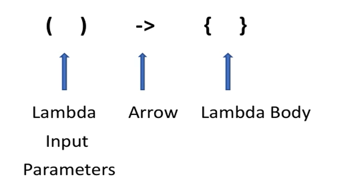

# ReWiringJava8
Revising Java 8

Why Java 8 ?
-------------
1. Supports functional programming
   1. embraces creating immutable objects
   2. more concise and readable
   3. allows passing of functions as a method parameters
   4. declarative way of writing code
      1. We are only worried about the result not the algorithm behind it.
         1. Ex: SQl quires
2. Effective utilization of system resources
   1. provides many concurrent libraries
   2. parallel streams

Declarative VS Imperative
-------------------------
   1. Imperative
      1. Immutable objects
         1. can result in problems while running in multithreaded environment
      2. Not Readable Code
   2. Declarative
      1. Logic is abstracted
         1. Don't worry about how it is done
      2. More readable
   
   Note : Examples are present in ImperativeDeclarative Package

Lambda Expressions
-----------------
   1. Same has method without a name
   2. Anonymous Function
   3. Can be assigned to a variable and can be passed around
   4. Not tied to class
   5. Structure
      
   6. Usage 
      1. used to implement **Function Interfaces**
   7. Syntax
      1. No {} - if single statement is present
      2.  Dropping Input parameters type - we can drop the type of parameters if compiler is able to resolve them

Functional Interfaces
---------------------
1. Interface Which has only one abstract method is known as functional interface
   1. but can have any default and static methods
2. **@FunctionalInterface** annotation id used to represent the functional interfaces
3. Functional interfaces make it easier to write functional-style code by reducing the verbosity of anonymous inner classes.
4. Java libraries like Streams and Collections have written to support functional interfaces
   1. Example enhanced forEach loop
5. Its makes code readable and reusable

Important Functional Interfaces
------------------------------
Consumer
--------
   1. Represents an operation that accepts a single input argument and returns no result.
   2. has void `accept(T t)` method
2. Consumer Chaining
   1. `andThen(Consumer)` -- See Functional Interfaces Example Two
3. **BiConsumer**
   1. `accept(T t, T t)`
   2. `addThen(Consumer)`

