# ReWiringJava8
Revising Java 8

Why Java 8 ?
-------------
1. Supports functional programming
   1. embraces creating immutable objects
      1. Example
         1. Streams API: The Streams API introduced in Java 8 encourages a functional programming style that works well with immutable objects. Operations on streams do not modify the underlying data source; instead, they return a new stream that reflects the result. This aligns with the principle of immutability, where instead of changing an object, you create a new object with the modified state.
   3. more concise and readable
   4. allows passing of functions as a method parameters
      1. Useful when you are implemting callbacks
   5. declarative way of writing code
      1. We are only worried about the result not the algorithm behind it.
         1. Ex: SQl quires
2. Effective utilization of system resources
   1. provides many concurrent libraries
   2. parallel streams

Declarative VS Imperative
-------------------------
   1. Imperative
      1. Immutable objects
         1. can result in problems while running in multithreaded environment
      2. Not Readable Code
   2. Declarative
      1. Logic is abstracted
         1. Don't worry about how it is done
      2. More readable
   
   Note : Examples are present in ImperativeDeclarative Package

Lambda Expressions
-----------------
   1. Same has method without a name
   2. Anonymous Function
   3. Can be assigned to a variable and can be passed around
   4. Not tied to class
   5. Structure
      
   6. Usage 
      1. used to implement **Function Interfaces**
   7. Syntax
      1. `No {} & return keyword` - if single statement is present
      2. `Dropping Input parameters type` - we can drop the type of parameters if compiler is able to resolve them
      3. `Dropping ()` - if there is only one parameter
   8. Restrictions on local variables
      1. Cannot redeclare or reassign the same local variable inside lambda
      2. In lambda scope local variables are effectively final
   9. No Restrictions on instance and class(static) variables

Functional Interfaces
---------------------
1. Interface Which has only one abstract method is known as functional interface
   1. but can have any no of default and static methods
2. `@FunctionalInterface` annotation id used to represent the functional interfaces
3. Functional interfaces make it easier to write functional-style code by reducing the verbosity of anonymous inner classes.
4. Java libraries like Streams and Collections have written to support functional interfaces
   1. Example enhanced forEach loop
5. **_Its makes code readable, reusable and maintainable_** 
6. All functional interfaces are present in following package
   1. `import java.util.function`

Important Functional Interfaces
------------------------------
Consumer
--------
   1. Represents an operation that accepts a single input argument and returns no result.
   2. has void `accept(T t)` method
2. Consumer Chaining
   1. `andThen(Consumer)` -- See Functional Interfaces Example Two
3. **BiConsumer**
   1. `accept(T t, T t)`
   2. `addThen(Consumer)`
   
Predicate
---------
1. Represents a predicate (boolean-valued function) of one argument.
2. `boolean test(T t) `-Evaluates this predicate on the given argument.
3. Chaining
   1. And
      1. `default Predicate<T> and(Predicate<? super T> other)`
   2. Or
      1. `default Predicate<T> or(Predicate<? super T> other)`
   3. Negate
      1. `default Predicate<T> negate()`
   4. Equal - Returns a predicate that tests if two arguments are equal according to Objects.equals(Object, Object).
      1. `static <T> Predicate<T> isEqual(Object targetRef)`
4. BiPredicate
   1. Represents a predicate (boolean-valued function) of two arguments. This is the two-arity specialization of Predicate.
   2. `boolean test(T t, U u)` - Evaluates this predicate on the given arguments.
   3. Chaining
      1. And
         1. `default BiPredicate<T, U> and(BiPredicate<? super T, ? super U> other)`
      2. Or
         1. `default BiPredicate<T, U> or(BiPredicate<? super T, ? super U> other) `
      3. negate
         1. `default BiPredicate<T, U> negate()`

Function
-------
1. Represents a function that accepts one argument and returns a result.
2. `R apply(T t)` -- takes input a returns output
3. Chaining
   1. Compose - Returns a composed function that first applies the before function to its input, and then applies this function to the result.
      1. `default <V> Function<V, R> compose(Function<? super V, ? extends T> before)`
      
   2. addThen - Returns a composed function that first applies this function to its input, and then applies the after function to the result.
      2. `default <V> Function<T, V> andThen(Function<? super R, ? extends V> after) `
   
4. BiFunction
   1. Takes two arguments and returns one
      1. `R apply(T t, U u);`
   2. Chaining
      1. addThen -Returns a composed function that first applies this function to its input, and then applies the after function to the result.
         1. `default <V> BiFunction<T, U, V> andThen(Function<? super R, ? extends V> after)`

Unary Operator
-------------
1. If input and output of same type
2. **Inherits the functionality** of **Function** Functional Interface
3. Example
   

BinaryOperator
-------------
1. If 2 input and output of same time
2. **Inherits the functionality** of **BiFunction** Functional Interface
3. Utility Methods
   1. minBy - return min of two input parameters based on provided comparator
      1. `public static <T> BinaryOperator<T> minBy(Comparator<? super T> comparator)` 
   2. maxBy - return max of two input parameters based on provided comparator
      1. `public static <T> BinaryOperator<T> maxBy(Comparator<? super T> comparator)`
4. Example
   

Supplier
--------
1. Don't take input but returns
2. `T get();`
3. Example
   

Method References
-----------------
1. Method reference is used to refer method of functional interface. 
   1. **Reuse to existing method via method reference to represent lambda expression**
2. Each time when you are using lambda expression to just referring a method, you can replace your lambda expression with method reference. 
3. Types of method references
   1. Method reference to an instance method of a **particular object** of a class
   2. Method reference to the static method of a class
   3. Reference to an Instance Method of an Arbitrary Object of a Particular Type
      1. This type of method reference refers to non-static instance methods without creating a custom object. It uses an anonymous object to refer to the instance method.
      2. Here arbitrary object should be parameter of lambda expression
      
4. Method reference to a constructor
   1. This type of method reference refers to a constructor by using the new keyword.
   2. Empty and parameter constructors should be present accordingly to method reference
   
   
Streams
-------
1. Intro
   1. Streams are introduced to promote declarative way of programming 
   2. Makes developer life easy to work with collection framework
   3. Functional interfaces, lambda expressions, streams will go in handy to make code readable and reusable
   4. Example
      
   5. How Streams Work
      1. Input Stream
      2. Intermediate Operations
      3. Terminal Operations
      4. `Note : Stream Intermediate are lazy and will only be invoked by terminal Method`
         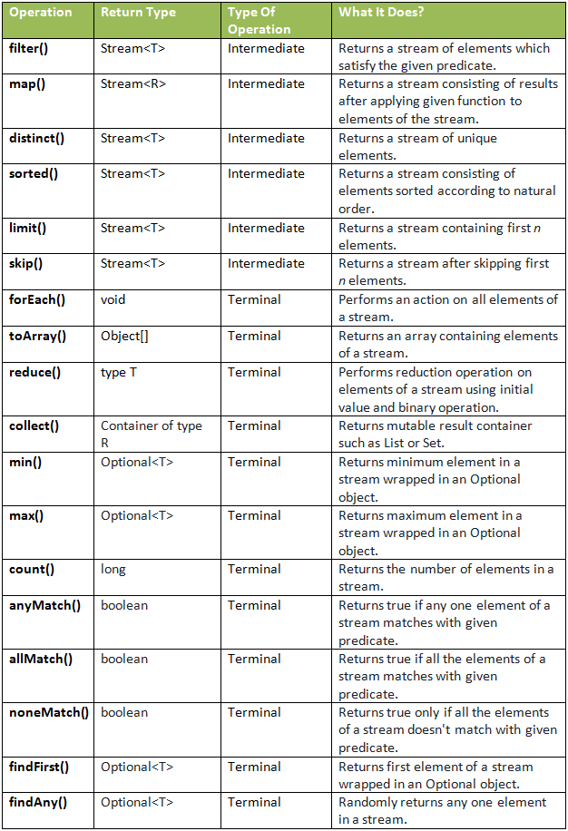
   6. Debugging a stream
      1. `Peek(Consumer)` intermediate method is used to see state of stream after every intermediate operation
Collection vs Stream
---------------------
   1. we cannot modify a stream once created. It is immutable explicitly
   2. No random access of an element from a stream
   3. Streams are lazy, and are activated by terminal operations
   4. Stream can only be used once
      1. Ex : We can't iterate a stream twice
   5. Streams are iterated internally vai forEach Method

Intermediate  & Terminal Operations
-----------------------------------
map()
----
1. It is an intermediate operation
2. Transform the input to required format
3. `<R> Stream<R> map(Function<? super T, ? extends R> mapper);`

Example

flatMap()
--------

1. Similar to map() it transforms input to different required format
2. Usually used to transform Stream of Multivalued Objects
   1. Example `Stream<List<String>>` --> List<String> 
      
      

distinct() || count() || sorted () 
---------------------------------

limit() || skip()
----------------
1. limit
   1. Consider only first n elements of stream
2. skip
   1. skip only first n elements of stream
3. Example
   

Reduce()
--------
   1. use to reduce stream of values to single value
   2. syntax
   3. Type 0
      
      
   4. Type 1
      
      
   5. Type 2
      
      
      
      

Boolean Terminal Operations
--------------------------
1. allMatch
2. anyMatch
3. noneMatch
4. Example
   

Find Terminal Operations
------------------------
1. findFirst
   1. return first element encountered ( if there is parallel it will return first encountered element among all parallel streams)
2. findAny
   1. returns first element encountered
3. returns `Optional<>`
4. Example
   
5. Ignores rest of the stream as soon a value is encountered

Stream Factory Methods
---------------------
1. of
   1. to create a stream 
   2.  `public static<T> Stream<T> of(T... values)`
2. iterate
   1. Infinite stream
   2. limit() can be used to stop infinity
   3. `public static<T> Stream<T> iterate(final T seed, final UnaryOperator<T> f)`
3. generate
   1. Infinite stream
   2. limit() can be used to stop infinity
   3. `public static<T> Stream<T> generate(Supplier<T> s)`
4. Example
   

Numeric Streams
--------------
1. Used to represent `primitive` values in a stream
2. Types
   1. IntStream
      1. Ranges
         1. range(m,n)
            1. n in not inclusive 
         2. rangeClosed(m,n)
            1. n is inclusive
   2. LongStream
      1. Ranges
         1. Same as IntStream
   3. DoubleStream
      1. Ranges
         1. No Method, but can be achieved by IntStream or LongStream
   4. Example
      
3. Aggregate Functions
   1. Max
   2. Min
   3. Sum
   4. Average
   5. Example
      
4. Boxing and UnBoxing
   1. boxed()
      1. used to convert primitive to object
   2. mapTo____
      1. used to convert object to primitive
   3. mapToObj
      1. used to map input to any predefined or Custom Object 
   4. Example
      

More Terminal Operations - Collect
----------------------
1. **joining**
   1. syntax
      1. `public static Collector<CharSequence, ?, String> joining()`
      2. `public static Collector<CharSequence, ?, String> joining(CharSequence delimiter)`
      3. `public static Collector<CharSequence, ?, String> joining(CharSequence delimiter, CharSequence prefix, CharSequence suffix)`
   2. Example
      1. Code
         
      2. output
         
2. **counting**
   1. syntax
      1. `public static <T> Collector<T, ?, Long> counting()`
   2. Example
      
3. **mapping**
   1. syntax
      `public static <T, U, A, R> Collector<T, ?, R> mapping(Function<? super T, ? extends U> mapper, Collector<? super U, A, R> downstream)`
   2. Example
      
4. **maxBy & minBy**
   1. Takes instance of `Comparator` as input and sorts accordingly
   2. returns `Optional` 
   3. Syntax
      1. minBy `public static <T> Collector<T, ?, Optional<T>> minBy(Comparator<? super T> comparator)`
      2. maxBy `public static <T> Collector<T, ?, Optional<T>> maxBy(Comparator<? super T> comparator)`
   4. Example
      
5. **summingInt & averagingInt**
   1. syntax
      1. `public static <T> Collector<T, ?, IntSummaryStatistics> summarizingInt(ToIntFunction<? super T> mapper)`
         1. Example
            
      2. ` public static <T> Collector<T, ?, Double> averagingInt(ToIntFunction<? super T> mapper)`
         1. Example
            
   
6. **summingLong || summingDouble || averagingLong || averagingDouble**
   1. Same as `summingInt & averagingInt`

7. **groupingBy**
   1. same as SQL groupBy
   2. Types
      1. Type 1
         1. Syntax
            1. `public static <T, K> Collector<T, ?, Map<K, List<T>>> groupingBy(Function<? super T, ? extends K> classifier)`
            2. Example
               
            3. Output
               
         2. Custom Function
            1. Example
               
            2. Output
               1. 
            
      2. Type 2
         1. Two level
         2. syntax
            1. classifier – a classifier function mapping input elements to keys
            2. downstream – a Collector implementing the downstream reduction
            3. `public static <T, K, A, D> Collector<T, ?, Map<K, D>> groupingBy(Function<? super T, ? extends K> classifier,Collector<? super T, A, D> downstream)`
            4. Example
               
               
               
               
      3. Type 3 
         1. Syntax
            `public static <T, K, D, A, M extends Map<K, D>>
            Collector<T, ?, M> groupingBy(Function<? super T, ? extends K> classifier,
            Supplier<M> mapFactory,
            Collector<? super T, A, D> downstream)`
         2. Example
            
            

collectAndThen
-------------
1. **to work with Optional<>**
2. syntax
   1. `public static<T,A,R,RR> Collector<T,A,RR> collectingAndThen(Collector<T,A,R> downstream, Function<R,RR> finisher)`
3. Example
   

partitionBy
----------
1. Similar to groupBy
2. accepts a predicate
3. returns a map
   1. **keys will only be true and false**
4. syntax
   1. `public static <T> Collector<T, ?, Map<Boolean, List<T>>> partitioningBy(Predicate<? super T> predicate)`
      1. Example
         
   2. `public static <T, D, A> Collector<T, ?, Map<Boolean, D>> partitioningBy(Predicate<? super T> predicate, Collector<? super T, A, D> downstream)`
      1. Example
         `

parallel Streams
--------------
1. Improves the application performance by utilizing system resource optimally
2. Internally Fork/Join framework to achieve efficiency
3. Example
   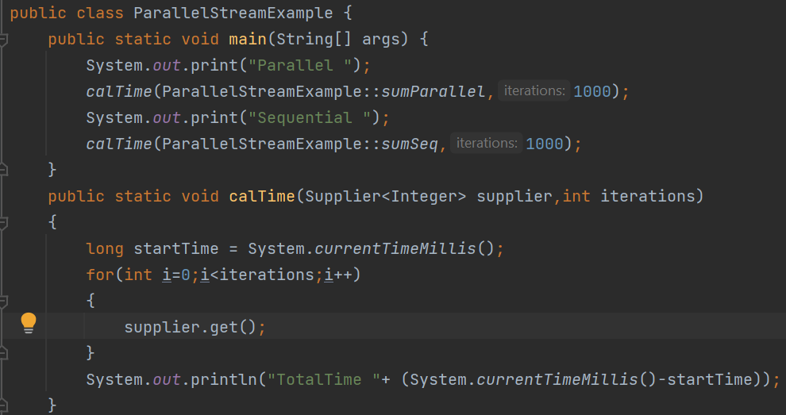
   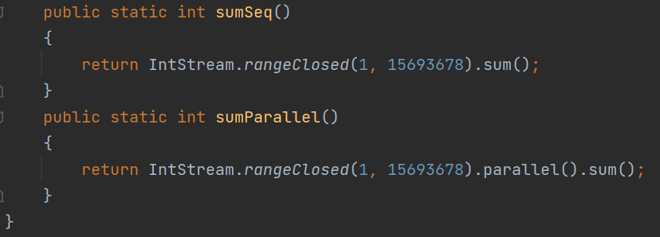
   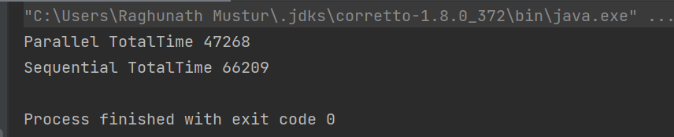
4. Not to use Parallel Streams
   1. If not used wisely parallel stream will **perform badly** compared to sequential 
   2. if you are having a chance of race condition ( updating mutable object )
5. Always check the performance of a method under sequential and parallel scenarios before using them

Optional
-------
1. The purpose of the class is to provide a type-level solution for representing optional values instead of null references.
2. Why
   1. Let's start with an example to see the dangers of null. Let's consider a nested object structure for a Computer, as illustrated in Figure 1.
   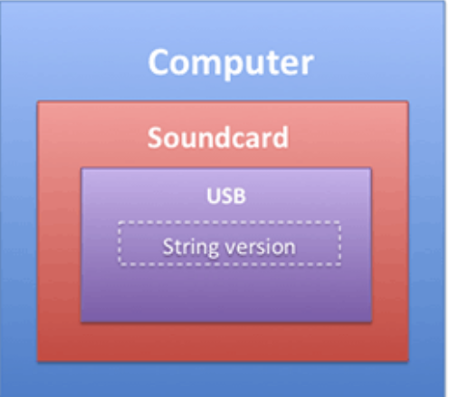
   2. What can you do to prevent unintended null pointer exceptions? You can be defensive and add checks to prevent null dereferences, as shown in Listing
   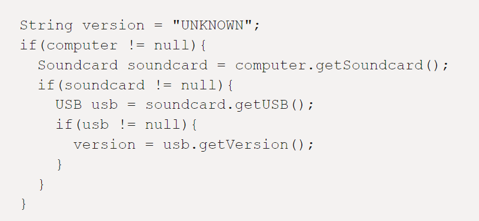
   3. you can see that the code in Listing 1 quickly becomes very ugly due to the nested checks. Unfortunately, we need a lot of boilerplate code to make sure we don't get a NullPointerException. In addition, it's just annoying that these checks get in the way of the business logic. In fact, they are decreasing the overall readability of our program.
3. Methods
   1. ofNullable
      1. Returns an Optional describing the specified value, if non-null, otherwise returns an empty Optional.
      2. used to wrap an object that might be become null
      3. syntax
         1.` public static <T> Optional<T> ofNullable(T value)`
         1. Example
            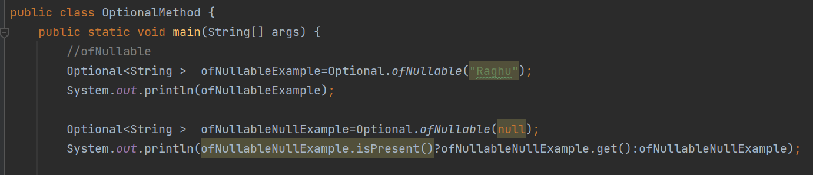
            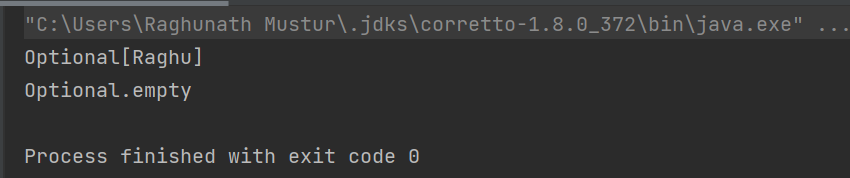
   2. of
      1. used to wrap non-null object, if object is null then it throws null pointer exception
      2. syntax
         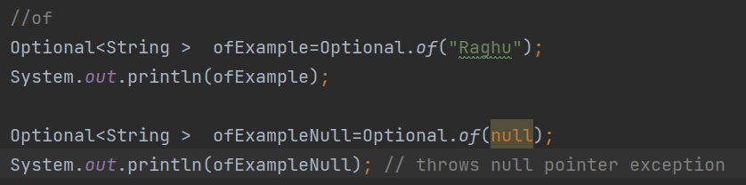
   3. empty
      1. Returns an empty Optional instance. No value is present for this Optional
      2. Syntax
         1. `public static<T> Optional<T> empty()`
      3. Example
         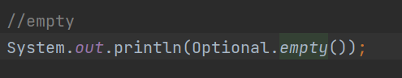
   4. orElse
      1. Return the value if present, otherwise return other.
      2. Syntax
         1. `public T orElse(T other)`
      3. Example
         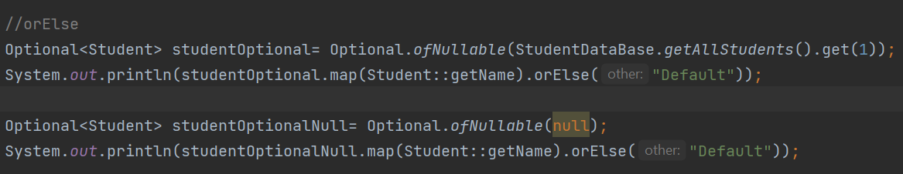
         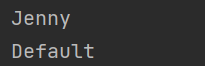
   5. orElseGet
      1. Same as orElse but takes **Supplier** as input
      2. Syntax
         1. `public T orElseGet(Supplier<? extends T> other)`
      3. Example
         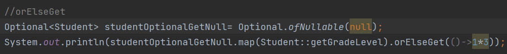
   6. orElseThrow
      1. Return the contained value, if present, otherwise throw an exception to be created by the provided supplier.
      2. Takes supplier as input
      3. Syntax
         1. `public <X extends Throwable> T orElseThrow(Supplier<? extends X> exceptionSupplier) throws X`
      4. Example
         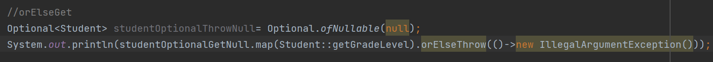
   7. ifPresent
      1. If a value is present, invoke the specified consumer with the value, otherwise do nothing.
      2. Syntax
         1. `public void ifPresent(Consumer<? super T> consumer)`
         2. Example
            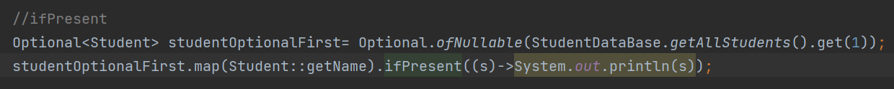
   8. filter and map
      1. filter
         1. If a value is present, and the value matches the given predicate, return an Optional describing the value, otherwise return an empty Optional.
         2. Syntax
            1. `public Optional<T> filter(Predicate<? super T> predicate)`
      2. map
         1. If a value is present, apply the provided mapping function to it, and if the result is non-null, return an Optional describing the result. Otherwise return an empty Optional.
         2. Syntax
            1. `public<U> Optional<U> map(Function<? super T, ? extends U> mapper)`
         3. Example
            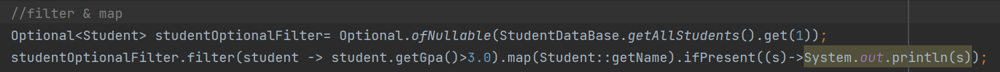
   9. flatMap
      1. Used only Nested Optional inside an object
      2. If a value is present, apply the provided Optional-bearing mapping function to it, return that result, otherwise return an empty Optional. This method is similar to map(Function), but the provided mapper is one whose result is already an Optional, and if invoked, flatMap does not wrap it with an additional Optional.
      3. syntax
         1. `public<U> Optional<U> flatMap(Function<? super T, Optional<U>> mapper)`
      4. Example 
         1. Check OptionalClass.flatMapExample.java

Summary of functions
------

Short Circuit Operations
------------------------
1. Does not iterate total streams but returns as soon as requirement is met

